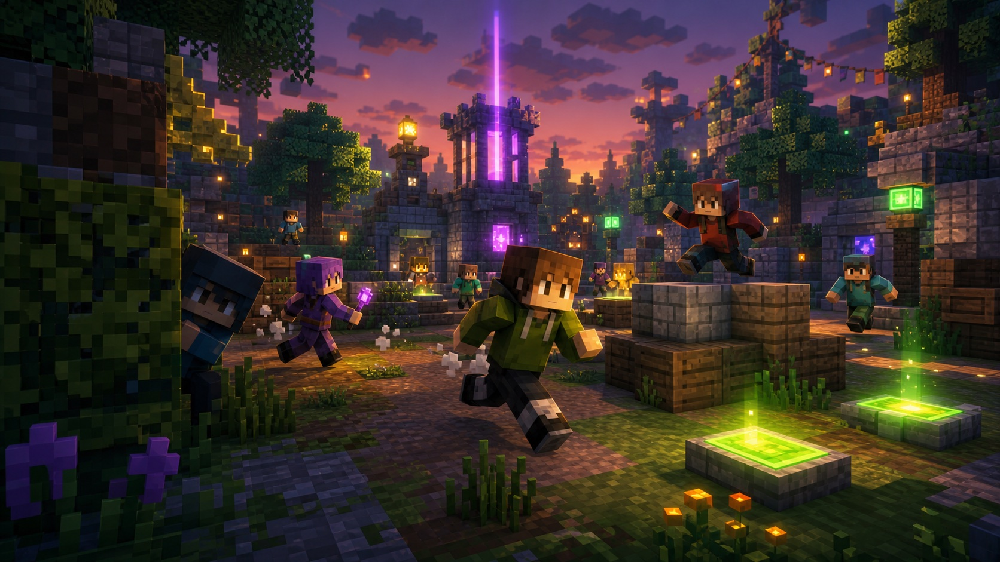

**これは Clasteria Website のデモ記事です。内容は LLM によって生成されたフィクションです。**

---

お待たせいたしました！ベータテストで好評を博した高速パルクールバトル「SkyRush (スカイラッシュ)」が、本日より正式リリースとなります。浮遊する島々を飛び移りながら、ゴールを目指して競い合いましょう。

---

## SkyRush とは？

「SkyRush」は、パルクール (アスレチック) と PvP を融合させた新しいゲームモードです。プレイヤーは崩れ落ちる足場や、敵からのノックバック攻撃を避けながら、誰よりも早く頂上のゴールフラッグを目指します。

### ゲームのルール

1. スタート: 最大 16 人のプレイヤーが一斉にスタートします。
2. 道中: コース上には「スピードブースト」や「ジャンプパッド」などのギミックが配置されています。
3. 妨害: アイテムボックスから手に入る「雪玉」や「ノックバックスティック」でライバルを突き落とすことができます。
4. 勝利条件: ゴールエリアへ到達した最初のプレイヤーが勝者です。

## 正式版での変更点

ベータ版からのフィードバックを受け、以下の通り調整しました。

- 新マップ追加:「キャンディ・キングダム」と「ネオン・シティ」の 2 マップを追加
- バランス調整: ノックバック耐性アイテムの効果時間を短縮
- 報酬アップ: 勝利時の獲得コインを 1.5 倍 に増量

## リリース記念キャンペーン

SkyRush の正式リリースを記念して、期間中 SkyRush を 5 回プレイしたほう全員に、限定コスメティック「天使の羽 (マント)」をプレゼントします！

- 期間: 2024 年 9 月 20 日 ～ 10 月 5 日
- 条件: 期間内に SkyRush の試合を最後まで 5 回プレイする (順位は問いません)

ロビーのゲームセレクターから、今すぐ参加しましょう！
