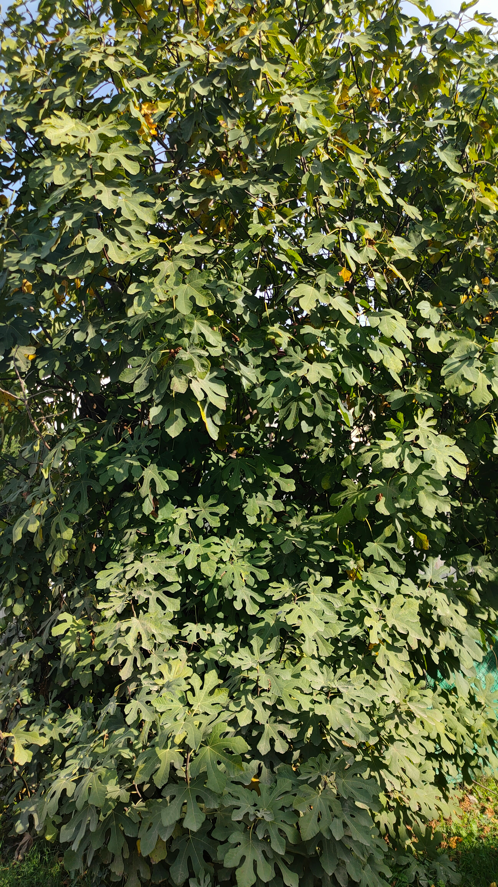

**これは Clasteria Website のデモ記事です。内容は LLM によって生成されたフィクションです。**

---

春の大型アップデートとして、冒険者のための新マップ「巨木の森」を追加しました。美しい巨木が立ち並ぶ広大なフィールドには、新しいギミック、敵、収集アイテムが散りばめられており、探索と戦闘の両方で新鮮な体験を提供します。

---

## 概要

新マップ「巨木の森」は、探索を重視した中〜上級者向けのエリアです。地形の高低差や、空中をつなぐ根の橋、夜になると発光するコケなど、視覚的な豊かさも兼ね備えています。

## 主要な追加要素

- マップ: 巨木の森 (新エリア)
- 新しい敵種: コロニー・スプライト (群れで行動)
- 新ギミック: 根の橋 (時間で形状が変化)
- 新収集物: 蓄光ゴケ (クラフト素材)
- デイナイトサイクルの演出強化

## マップの特徴

1. 地形の高さ差
   - 崖と根が複雑に入り組み、垂直方向の探索が楽しめます。
2. 環境ギミック
   - 根の橋は一定時間ごとに有効/無効を切り替わります。タイミングを見て渡る必要があります。
3. 夜間の演出
   - 一部のエリアは夜間に蓄光ゴケが光り、道しるべのようになります。

## 遊び方 (クイックスタート)

1. マップ選択画面で「巨木の森」を選びます。
2. 初回は南のキャンプから開始することを推奨します。
3. 根の橋は視覚的に点滅するので、点滅が収まった瞬間を狙って渡ってください。

## よくある質問

- Q: 初心者でも遊べますか？
  - A: 推奨レベルは 20 前後のため、初めての方は導入クエストでレベルを上げてから来ることを推奨します。
- Q: 蓄光ゴケはどこで使えますか？
  - A: クラフトメニューの「装飾アイテム」カテゴリで使用できます。

---

## 更新履歴

- 2024-12-01 - 初回リリース: 巨木の森追加、コロニー・スプライト実装
